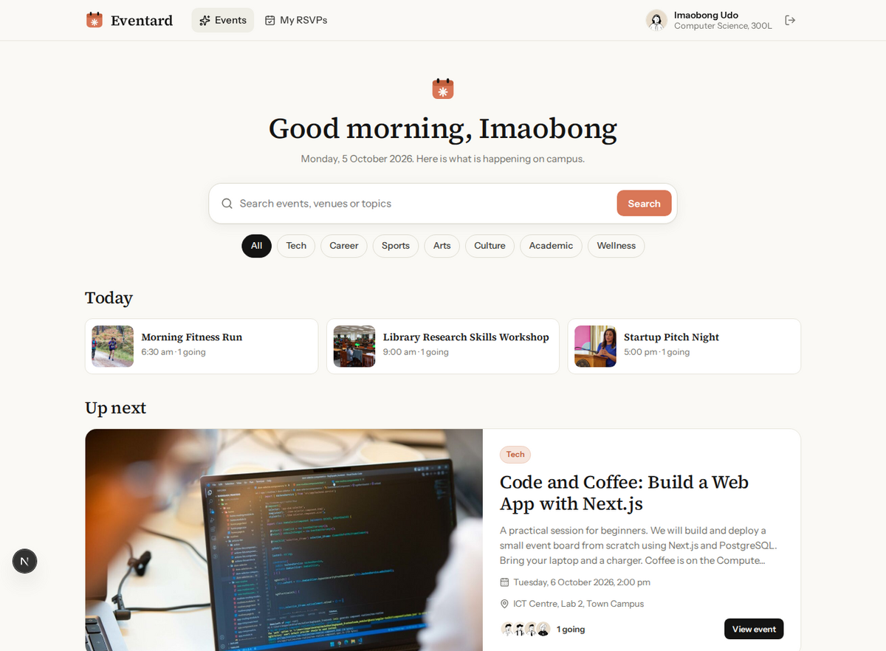

# Eventard

Campus event board for the University of Uyo. Students browse events, RSVP and add them to Google Calendar. Student Affairs publishes events that show up on every open board within seconds.



Full documentation with annotated screenshots: [docs/Eventard-Documentation.pdf](docs/Eventard-Documentation.pdf)

## Features

- Event board with search, category filters, a Today strip and an Up next card
- RSVP with a live count (the page refreshes server data every few seconds)
- Capacity limits enforced in a database transaction, so events cannot be overbooked
- Add to Google Calendar link built from the event data (UTC dates, URL-encoded fields, no API key)
- My RSVPs page scoped to the signed-in student
- Admin dashboard: stats, publish, edit, cancel, restore and delete events, attendee lists
- Banner upload (stored in Postgres) or a library of real Creative Commons photos
- Inline form validation with Zod
- Works on phones

## Demo logins

| Role | Email | Password |
| --- | --- | --- |
| Student | student@uniuyo.edu.ng | student123 |
| Admin | admin@uniuyo.edu.ng | admin123 |

The sign-in page is prefilled with the student account.

## Tech stack

Next.js 16 (App Router, Server Components, Server Actions), TypeScript (strict), Drizzle ORM with PostgreSQL and drizzle-kit migrations, Zod, bcryptjs and jose for sessions, lucide-react icons, DiceBear avatars, Fontsource fonts, Vitest and Playwright.

## Quick start

```bash
service postgresql start
sudo -u postgres createdb eventard
sudo -u postgres createdb eventard_test
cp .env.example .env    # set DATABASE_URL and SESSION_SECRET
npm install
npm run db:migrate
npm run db:seed
npm run dev             # http://localhost:3000
```

Set `EVENTARD_TODAY=2026-10-05` to freeze the clock for rehearsals and tests.

## Scripts

| Script | What it does |
| --- | --- |
| `npm run dev` | Development server |
| `npm run build` / `npm start` | Production build and server |
| `npm run start:prod` | Migrate, seed if the database is empty, start on 0.0.0.0 (Railway) |
| `npm run db:generate` | New SQL migration from `src/db/schema.ts` |
| `npm run db:migrate` | Apply migrations |
| `npm run db:seed` | Reset and seed demo data dated relative to today |
| `npm run test:unit` | Unit tests |
| `npm run test:integration` | Integration tests against `eventard_test` |
| `npm run test:e2e` | Playwright tests (desktop and mobile) |
| `npm run docs:pdf` | Rebuild the PDF documentation |

## Deployment

Railway project `school-projects`, service `eventard` with its own `eventard-postgres` database. Settings are in `railway.json`: build `npm run build`, start `npm run start:prod`, health check `/api/health` (it pings the database).

## Image credits

Event photos are Creative Commons images found through Openverse. Authors, licences and links are in `public/images/events/credits.json`.
